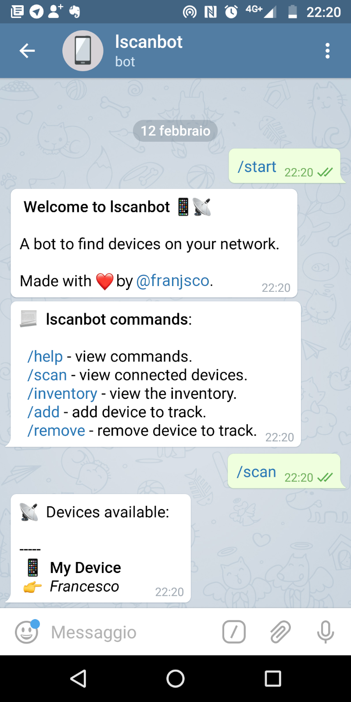

<h1 align="center">Welcome to lscanbot 📱</h1>
<p>
  <a href="https://github.com/franjsco/lscanbot/graphs/commit-activity" target="_blank">
    
  </a>
  <a href="https://github.com/franjsco/lscanbot/blob/master/LICENSE" target="_blank">
    
  </a>
  <a href="https://twitter.com/franjsco" target="_blank">
    
  </a>
</p>

> A telegram bot to find devices on your LAN.



## Install

### Step by step
1. Install **arp-scan** package on your GNU/Linux system. 
2. Configure **arp-scan** to use without sudo. (`chmod u+s`)
3. Clone this repository on your system.
4. Install dependecies with `npm install`.
5. Create new bot with **@BotFather** on Telegram.
6. Insert your **API Token** (app.token) into `config.json`.
7. Insert your **Telegram ID** (app.authorizedUsers) into `config.json`.
8. Insert your **Network Device** (scanner.interface) into `config.json`.

## Usage
Start server:
```sh
npm run start
```

**lscanbot** scans devices with arp-scan, showing only devices registered in the inventory.

### Scan
Before scanning, you must insert the devices into the inventory (to track it):
> /add [Device name] ; [Owner] ; [MAC Address]

(use `;` to split arguments)

example: (/add Motorola Moto G6; Frank; AB:CC:MY:MC:AD)


After that, you can scan:
>/scan


It will send back the devices connected to your network.

### Remove
> /remove [MAC Address]


## Author

👤 **franjsco (Francesco Esposito)**

* Website: https://franjsco.github.io/
* Twitter: [@franjsco](https://twitter.com/franjsco)
* Github: [@franjsco](https://github.com/franjsco)

## Show your support

Give a ⭐️ if this project helped you!

## 📝 License

Copyright © 2020 [franjsco (Francesco Esposito)](https://github.com/franjsco).<br />
This project is [GPL--3.0](https://github.com/franjsco/lscanbot/blob/master/LICENSE) licensed.

***
_This README was generated with ❤️ by [readme-md-generator](https://github.com/kefranabg/readme-md-generator)_